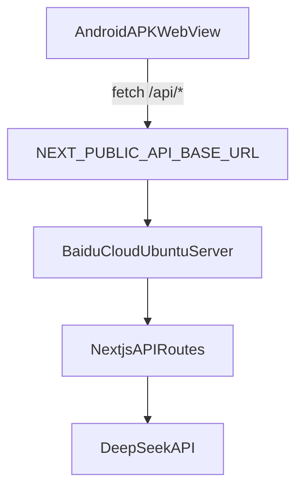

# 百度云后端 0 基础部署手册（超详细）

适用对象：没有域名、没有云服务器部署经验，希望把当前项目后端先跑起来，并让手机 APK 可联网调用。

适用项目：`aigc_application_style`（Next.js API 路由）。

---

## 0. 你将得到什么

完成本文后，你将得到：

1. 百度云 Ubuntu 服务器上稳定运行的后端（PM2 托管）。
2. 可访问的接口：
   - `GET /api/health`
   - `POST /api/chat`
3. 手机 APK 可通过 `NEXT_PUBLIC_API_BASE_URL` 访问后端。
4. 后续升级到域名 + HTTPS 的完整路径。

---

## 1. 架构说明（先理解）



- APK 内前端会把 `/api/*` 变成 `NEXT_PUBLIC_API_BASE_URL + /api/*`。
- 所以只要这个地址可达，且后端 CORS 正确，手机就能调用成功。

---

## 2. 阶段 A：无域名上线（先跑通）

## 2.1 百度云创建服务器

在百度云控制台创建：

- 地域：离你近的机房（例如华北/华东）。
- 实例：Ubuntu 22.04。
- 配置：建议 2 核 4G（测试可 2 核 2G）。
- 系统盘：至少 40G。
- 带宽：3Mbps 起步（测试可用）。

记录以下信息（写到你的笔记）：

- `SERVER_IP=154.12.28.62`
- `SERVER_USER=root`（后续可换普通用户）
- `SERVER_PASSWORD=你的密码` 或已配置 SSH key

---

## 2.2 配置安全组（非常关键）

入站规则至少开放：

- `22/tcp`：SSH（建议只允许你的公网 IP）
- `3000/tcp`：Next.js 后端临时端口
- `80/tcp`：后续 Nginx HTTP
- `443/tcp`：后续 HTTPS

如果只做阶段 A，可以先开 22 + 3000。

---

## 2.3 首次登录服务器

本地 PowerShell：

```powershell
ssh root@154.12.28.62
```

首次会提示指纹，输入 `yes`。

---

## 2.4 一键安装运行环境

将仓库中的脚本传到服务器（你也可以先 git clone 再执行）：

```bash
bash scripts/server/bootstrap-baidu-ubuntu.sh
```

脚本会安装：

- `git`
- `node/npm`
- `pm2`
- `nginx`
- `ufw`（并开放 22/80/443/3000）

执行后验证：

```bash
node -v
npm -v
pm2 -v
sudo ufw status
```

---

## 2.5 拉取代码并部署后端

### 方式 1：自动脚本（推荐）

先设置 DeepSeek 变量（示例）：

```bash
export DEEPSEEK_API_KEY="你的真实key"
export DEEPSEEK_BASE_URL="https://api.deepseek.com/chat/completions"
export DEEPSEEK_MODEL="deepseek-chat"
export APP_PORT="3000"
```

执行部署脚本：

```bash
bash scripts/server/deploy-next-api.sh \
  --repo "https://github.com/你的账号/你的仓库.git" \
  --app-dir "/srv/ps2-api" \
  --branch "main"
```

### 方式 2：手工部署（备用）

```bash
mkdir -p /srv/ps2-api
cd /srv/ps2-api
git clone https://github.com/zzh-bit/aigc_application_style.git .
npm ci || npm install
npm run build:server
pm2 start npm --name ps2-api -- start
pm2 save
pm2 startup
```

说明：

- 云服务器后端必须用 `npm run build:server`（支持 `next start` + `/api/*`）。
- `npm run build:android` 仅用于 APK 静态导出，不可用于云服务器后端启动。

---

## 2.6 验证后端是否真的在线

服务器本机验证：

```bash
curl -i http://127.0.0.1:3000/api/health
```

本地电脑验证：

```powershell
curl http://154.12.28.62:3000/api/health
```

期望结果：HTTP 200，返回 JSON（`ok: true`）。

---

## 2.7 验证 CORS 与聊天接口

在本地项目根目录运行（已提供）：

```powershell
powershell -ExecutionPolicy Bypass -File ./scripts/verify-phone-api.ps1 -ApiBaseUrl "http://154.12.28.62:3000"
```

它会依次检查：

1. `GET /api/health`
2. `OPTIONS /api/chat`（Origin 为 `https://appassets.androidplatform.net`）
3. `POST /api/chat`

只要有 `[FAIL]`，先修后端，不要急着打 APK。

---

## 2.8 APK 对接百度云 IP

在本地项目 `.env.production` 设置：

```env
NEXT_PUBLIC_API_BASE_URL=http://154.12.28.62:3000
```

然后重建 APK：

```powershell
npm run build:android
npm run sync:android
npm run rebuild:export:apk
```

安装前先卸载旧包，再安装新包。

---

## 2.9 真机验收

至少做 3 轮对话：

1. 打开 APP 进入对话页
2. 连续发 3 条不同问题
3. 每条都返回成功

再验证：

- 议会接口（`/api/council/debate`）
- 情绪接口（`/api/emotion`）

---

## 3. 常见问题与修复

## 3.1 超时（timeout）

原因：

- 安全组没开 3000
- 服务器防火墙拦截
- 后端进程未启动

排查：

```bash
pm2 status
pm2 logs ps2-api --lines 100
sudo ufw status
ss -lntp | grep 3000
```

## 3.2 CORS 报错

现象：`blocked by CORS policy`

确认点：

- 预检 `OPTIONS` 必须返回 200/204。
- 响应头必须有：
  - `Access-Control-Allow-Origin: https://appassets.androidplatform.net`

## 3.3 APK 仍请求旧地址

原因：改了 env 但没重打包。

解决：必须完整执行：

1. `build:android`
2. `sync:android`
3. 重新打包 APK
4. 卸载旧包再安装

---

## 4. 阶段 B：升级域名 + HTTPS（推荐上线）

当你后续买好域名后：

1. DNS A 记录指向 `154.12.28.62`
2. 用 `deploy/nginx/ps2-api-http.conf` 配置 HTTP 反代
3. certbot 申请证书
4. 切换到 `deploy/nginx/ps2-api-https.conf`
5. 将 `NEXT_PUBLIC_API_BASE_URL` 改为 `https://wdzsyyh.cloud`
6. 重新打包 APK 并回归验证

---

## 5. 运维建议（最低标准）

- PM2 开机自启：`pm2 save && pm2 startup`
- 日志轮转：
  - 安装：`pm2 install pm2-logrotate`
  - 设置：`pm2 set pm2-logrotate:max_size 50M`
- 每周备份 `.env.production` 和 Nginx 配置（不要入 git）

---

## 6. 你下一步最小动作

1. 在百度云创建 Ubuntu 服务器并放开 22/3000。
2. 在服务器执行 `bootstrap-baidu-ubuntu.sh`。
3. 在服务器执行 `deploy-next-api.sh`。
4. 本地跑 `verify-phone-api.ps1 -ApiBaseUrl http://154.12.28.62:3000`。
5. 修改 `NEXT_PUBLIC_API_BASE_URL` 并重打 APK。
