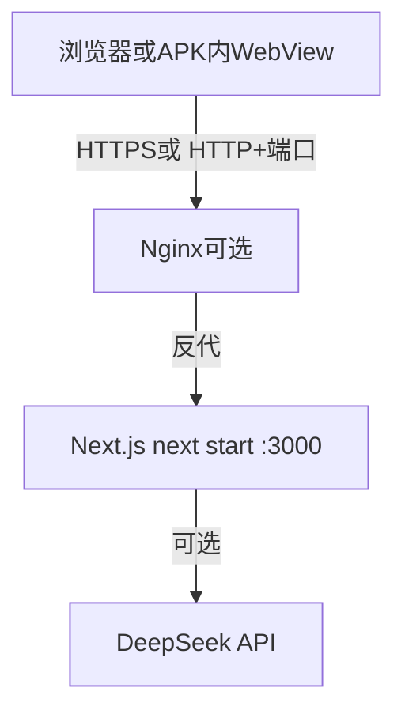

# 百度云后端重新部署手册（详细版）

本文档在 [BAIDU_CLOUD_BACKEND_DEPLOY_ZERO_TO_ONE.md](./BAIDU_CLOUD_BACKEND_DEPLOY_ZERO_TO_ONE.md)所述架构之上编写，面向 **已完成首次部署** 的场景：你需要发布新代码、更新依赖、或更换/确认环境变量后，让线上 **`next start` + PM2** 进程跑新版本。

若你尚未有云服务器、未装 Node/PM2/Nginx，请先完整跟完零基文档，再使用本文。

---

## 0. 重新部署时你要达成什么

1. 服务器上应用目录与 Git 远程一致（指定分支最新提交）。
2. 执行 **`npm run build:server`** 生成当前代码的生产构建（不是 `build:android`）。
3. **PM2** 重启进程并加载最新构建与环境变量。
4. 从外网验证 **`/api/health`**、关键业务接口（如 **`/api/chat`**、**`/api/projection`**）行为符合预期。

**仅后端变更**（只改 `app/api/*`、服务端逻辑等）：一般 **不需要** 重打 APK。  
**仅当**修改了前端静态资源或 **`NEXT_PUBLIC_*`**（例如 API 基址从 IP 换域名）：才需要在本地按零基文档 **`build:android` → sync → 打 APK**。

---

## 1. 架构回顾（与零基文档一致）



- **阶段 A**：外网可能直接访问 `http://<SERVER_IP>:3000`（零基文档示例 IP：`154.12.28.62`）。
- **阶段 B**：外网使用域名 + HTTPS（例如 `https://api.wdzsyyh.cloud`），由 Nginx 反代到本机 `127.0.0.1:3000`。详见 [PROJECT_BACKEND_STATUS.md](./PROJECT_BACKEND_STATUS.md)。

重新部署时 **通常不用改 Nginx**，除非端口或 upstream 变更。

---

## 2. 部署前准备（本地与服务器）

### 2.1 确认分支与提交

在 **本地开发机**：

```powershell
git status
git pull origin main
```

将你要上线的分支名记下（下文以 `main` 为例；若为 `release` 等请替换）。

### 2.2 确认服务器信息根据你首次部署时的记录，准备：

| 项 | 示例（零基文档） | 说明 |
|----|------------------|------|
| 服务器 IP | `154.12.28.62` | SSH 与阶段 A 访问用 |
| SSH 用户 | `root` | 或你的 sudo 用户 |
| 应用目录 | `/srv/ps2-api` | 与 `deploy-next-api.sh` 的 `--app-dir` 一致 |
| PM2 进程名 | `ps2-api` | 零基文档与脚本默认名；若以 `pm2 list` 为准 |

### 2.3 确认环境变量（尤其 DeepSeek）

服务端必须能读取 **`DEEPSEEK_API_KEY`**（勿提交到 Git、勿写入 APK）。  
可选：`DEEPSEEK_MODEL`、`DEEPSEEK_BASE_URL`（或项目内等价变量，以仓库 `app/api` 实际读取为准）。

若使用脚本部署，脚本会向应用目录写入 **`.env.production`**（仅服务器本地，权限建议 `600`）。手工维护时，改完变量后必须用 **`pm2 restart ... --update-env`**，否则进程仍用旧环境。

---

## 3. 方式一：服务器上手动物更新（最常用）

适合：代码已在服务器 Git 仓库中，你只改远程分支并拉取。

### 3.1 SSH 登录

本地 PowerShell：

```powershell
ssh root@154.12.28.62
```

（将 IP、用户换成你的实际值。）

### 3.2 进入应用目录并更新代码

```bash
cd /srv/ps2-api
git fetch --all
git checkout main
git pull origin main
```

若 `git pull` 报本地冲突，先备份改动再处理（生产环境建议禁止在服务器上直接改未跟踪文件，或改用固定发布流程）。

### 3.3 安装依赖（有 package变更时必做）

```bash
npm ci || npm install
```

-若 `package-lock.json` 已更新，优先 **`npm ci`**。
- 若仅少量服务端 TS/路由变更且无依赖变化，可跳过；但大版本升级后建议每次都执行。

### 3.4 生产构建（必须）

```bash
npm run build:server
```

**禁止**在云后端使用 `npm run build:android`：那是静态导出给 WebView 离线包用的，不能替代 **`next start`** 所需的 server 构建。

构建失败时根据终端报错修复（TypeScript、环境变量缺失等），**不要**在失败状态下重启 PM2。

### 3.5 重启 PM2 并加载新环境

```bash
pm2 restart ps2-api --update-env
pm2 save
```

若进程名不是 `ps2-api`：

```bash
pm2 list
pm2 restart <实际名称> --update-env
```

查看最近日志确认无启动报错：

```bash
pm2 logs ps2-api --lines 80
```

### 3.6 本机快速探测（服务器上执行）

```bash
curl -sS -i http://127.0.0.1:3000/api/health
```

期望：`HTTP/1.1 200`，JSON 内含正常健康字段（具体以 `app/api/health` 实现为准）。

---

## 4. 方式二：使用仓库自带部署脚本（全量覆盖式）

适合：你希望脚本统一写 **`.env.production`**、安装依赖、构建并重启 PM2。

在 **服务器** 上，于仓库根目录（或已 clone 的 `/srv/ps2-api`）执行前设置密钥：

```bash
export DEEPSEEK_API_KEY="你的真实key"
export DEEPSEEK_BASE_URL="https://api.deepseek.com/chat/completions"
export DEEPSEEK_MODEL="deepseek-chat"
export APP_PORT="3000"
```

然后：

```bash
bash scripts/server/deploy-next-api.sh \
  --repo "https://github.com/你的账号/你的仓库.git" \
  --app-dir "/srv/ps2-api" \
  --branch "main"
```

说明：

- 脚本会 **`git pull`**、写 **`.env.production`**、**`npm ci`**、**`npm run build:server`**、**`pm2 restart ps2-api --update-env`**（若进程不存在则 `pm2 start`）。
- **会覆盖**应用目录下的 **`.env.production`** 中与脚本相关的项；若你手工加过其他变量，请事后检查或改为在 PM2 ecosystem 中统一管理。

完整脚本路径：`scripts/server/deploy-next-api.sh`。

---

## 5. 外网与业务验证（阶段 A：IP + 端口）

在 **本地 Windows**，将 IP 与端口换成你的阶段 A 地址：

```powershell
curl.exe -sS "http://154.12.28.62:3000/api/health"
```

项目根目录一键脚本（含 CORS 与聊天探测）：

```powershell
powershell -ExecutionPolicy Bypass -File .\scripts\verify-phone-api.ps1 -ApiBaseUrl "http://154.12.28.62:3000"
```

出现 `[FAIL]` 时，在服务器执行：

```bash
pm2 status
pm2 logs ps2-api --lines 100
sudo ufw status
ss -lntp | grep 3000
```

对照零基文档 **§3.1 超时**、**§3.2 CORS** 排查。

---

## 6. 外网与业务验证（阶段 B：域名 + HTTPS）

当前工程线上示例域名为 **`https://api.wdzsyyh.cloud`**（见 [PROJECT_BACKEND_STATUS.md](./PROJECT_BACKEND_STATUS.md)）。重新部署 **后端** 后，外网验证建议：

```powershell
powershell -ExecutionPolicy Bypass -File .\scripts\verify-phone-api.ps1 -ApiBaseUrl "https://api.wdzsyyh.cloud"
```

服务器本机仍应通过 **127.0.0.1:3000** 探测 Next 是否存活；若仅 Nginx 层 502，则检查 Nginx 与 upstream，而非盲目重打 APK。

### 6.1 可选：`/api/projection` 抽样因 POST 体需合法 JSON，可用 UTF-8 文件避免控制台编码问题（PowerShell 示例）：

```powershell
$body = '{"focusTopic":"要不要去北京工作","topic":"要不要去北京工作","contextMessages":[]}'
[System.IO.File]::WriteAllText("$PWD\apk-exports\_proj-probe.json", $body, [System.Text.UTF8Encoding]::new($false))
curl.exe -sS -X POST "https://api.wdzsyyh.cloud/api/projection" `
  -H "Content-Type: application/json; charset=utf-8" `
  --data-binary "@apk-exports/_proj-probe.json" `
  --max-time 120
```

部署新版本后，可将返回 JSON 与仓库当前 `app/api/projection/route.ts` 约定对照（例如是否包含 `meta` 等字段）。

---

## 7. 与 APK / Android 壳的关系

| 变更类型 | 是否需要重打 APK |
|----------|------------------|
| 仅服务端 `app/api/*`、服务端依赖、服务器 `.env`（含 `DEEPSEEK_API_KEY`） | **否** |
| `NEXT_PUBLIC_API_BASE_URL`、前端 `out/` 静态资源、`components/` 等打进包的资源 | **是**（按零基文档 `build:android` → sync → `rebuild:export:apk`等） |
| `android/ps2-shell` 内 `PS2_API_FORWARD_HOST` / 固定 IP | **是**（需重新 `assembleDebug` / 安装） |

APK 内 WebView 对 API 的访问路径见 [PROJECT_BACKEND_STATUS.md](./PROJECT_BACKEND_STATUS.md)（回环代理 +固定 IPv4 等）。

---

## 8. 回滚（简要）

若新版本上线后故障，在服务器应用目录：

```bash
cd /srv/ps2-api
git log --oneline -5
git checkout <上一稳定提交的hash或tag>
npm ci || npm install
npm run build:server
pm2 restart ps2-api --update-env
```

然后重复 **§5 或 §6** 的外网验证。

---

## 9. 重新部署检查清单（可复制）

- [ ] 本地已合并/推送目标分支，服务器 `git pull` 无冲突  
- [ ] 已执行 `npm run build:server` 且成功  
- [ ] 已 `pm2 restart ... --update-env`，`pm2 logs` 无持续报错  
- [ ] `curl 127.0.0.1:3000/api/health` 为 200  
- [ ] 外网 `verify-phone-api.ps1` 全 `[OK]`（按阶段 A 或 B 的 BaseUrl）  
- [ ] 若依赖或 Node 大版本变更，已阅读仓库 README/脚本说明并做过回归---

## 10. 文档关系

| 文档 | 用途 |
|------|------|
| [BAIDU_CLOUD_BACKEND_DEPLOY_ZERO_TO_ONE.md](./BAIDU_CLOUD_BACKEND_DEPLOY_ZERO_TO_ONE.md) | 从零创建服务器、安全组、bootstrap、首次部署 |
| 本文 |在已有环境上 **重复发布** 与验证 |
| [PROJECT_BACKEND_STATUS.md](./PROJECT_BACKEND_STATUS.md) | 域名 HTTPS、Nginx、PM2、与 APK 对接的现网说明 |
| `scripts/server/deploy-next-api.sh` | 可重复的自动化部署脚本 |

---

## 11. 修订记录

- **2026-04-15**：初版，基于零基部署文档结构整理「重新部署」专篇，并补充阶段 B、PM2、验证与 APK 边界说明。
